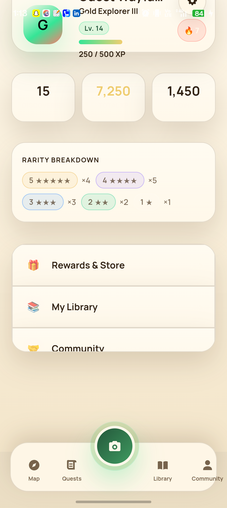

# Wild Realm

<p align="center">
  <strong>Turn the real world into quests.</strong><br/>
  Explore, capture, verify, level up, and build a living record of the places and discoveries that made you stop and look twice.
</p>

<p align="center">
  
</p>

<p align="center">
  <a href="https://github.com/Mrudula-itsjuzme/quests/releases/tag/v1.2.0"></a>
  
  
  
  
</p>

## What is Wild Realm?

Wild Realm is a mobile-first exploration platform built around a simple idea: **going outside should feel a little more like entering a game world.**

The app turns real-world experiences into quests. Explorers can discover nearby hotspots, capture what they find, submit evidence for verification, earn XP and coins, maintain streaks, unlock higher explorer tiers, collect discoveries in a journal, and find other explorers through public profiles and community search.

It is not just a quest checklist. The system is built around a server-authoritative progression model, evidence-backed captures, idempotent rewards, real map data, public discovery profiles, and native Android/iOS builds.

### The loop

`Explore → Capture → Verify → Earn → Collect → Share → Explore again`

## The experience

| Explore | Discover | Progress |
| --- | --- | --- |
| Browse curated world hotspots and your own GPS-tagged capture clusters. | Photograph real discoveries, complete quests, and build a personal field journal. | Earn XP and coins, build streaks, move through explorer tiers, and unlock rewards. |
| Satellite imagery with fallback map layers. | Daily, weekly, and monthly quest generation. | Bronze → Silver → Gold → Platinum → Diamond → Adamantium. |

Beyond the core loop, Wild Realm includes public explorer profiles, user search, leaderboards, a community feed, favorites, discovery history, species/detail views, rewards, notifications, onboarding, motion-aware UI, and a camera-first capture flow.

## Product snapshots

<p align="center">
  
  &nbsp;&nbsp;
  
  &nbsp;&nbsp;
  
</p>

The visual system leans into quiet field-journal textures, cream surfaces, forest greens, serif display type, map imagery, physical-feeling cards, and motion that should feel tactile rather than noisy.

## What is already built

- **Quest engine** with daily Mind, Body, and Discovery quests, weekly photo quests, and monthly expeditions.
- **Capture and verification flow** with private upload references, review decisions, perceptual-hash duplicate checks, and server-authoritative idempotent mutations.
- **World exploration** with curated hotspots, bounding-box/category queries, satellite imagery, OSM fallback, and personal GPS capture clusters.
- **Progression economy** with XP, coins, streaks, milestones, reward claims, collectible hooks, and a normalized six-tier explorer ladder.
- **Community layer** with feed, leaderboard, public profiles, follower counts, explorer stats, verified discovery grids, and searchable users.
- **Journal/gallery** with species detail pages, favorites, viewed state, categories, and discovery history.
- **Native app support** through Capacitor for Android and iOS, including camera, geolocation, device, keyboard, status bar, browser, and pedometer integrations.
- **Production safeguards** including account-state enforcement, RLS hardening, rate limiting, security headers, request timeouts, controlled cache headers, and production startup gates.
- **CI and release flow** with lint, typecheck, tests, builds, native validation, Docker verification, and release artifacts.

## Architecture

```text
┌──────────────────────────────────────────────┐
│              Wild Realm Clients              │
│                                              │
│  React + Vite Web    Capacitor Android/iOS   │
└───────────────────────┬──────────────────────┘
                        │
                        ▼
┌──────────────────────────────────────────────┐
│                 Express API                  │
│ auth • quests • world • captures • community│
│ rewards • media • admin • notifications     │
└───────────────┬───────────────────┬──────────┘
                │                   │
                ▼                   ▼
┌──────────────────────┐   ┌───────────────────┐
│ PostgreSQL           │   │ Supabase          │
│ authoritative state  │   │ auth + sessions   │
│ ledgers • quests     │   │ OIDC / JWT        │
│ captures • profiles  │   └───────────────────┘
└──────────────────────┘
```

### Core stack

| Layer | Technology |
| --- | --- |
| Frontend | React 19, Vite 8, React Router, TanStack Query |
| Motion / 3D | Framer Motion, Three.js, React Three Fiber |
| Maps | Leaflet, ArcGIS satellite imagery, OSM fallback |
| Native | Capacitor 8 for Android and iOS |
| API | Node.js 22+, Express 4, Zod |
| Auth | Supabase Auth, JOSE, asymmetric JWT verification |
| Data | PostgreSQL via `pg`, transactional migrations |
| Security | Helmet, rate limiting, RLS, account-state enforcement |
| Testing | Vitest, Testing Library, Supertest, ESLint, TypeScript |
| Deployment | Docker, Render configuration, GitHub Actions |

## Local development

### 1. Install

```bash
git clone https://github.com/Mrudula-itsjuzme/quests.git
cd quests
npm install
```

### 2. Start in local-provider mode

```bash
npm run migrate
export DEV_AUTH_ENABLED=true
export DEV_ALLOW_LEGACY_MUTATIONS=true
export PROVIDER_MODE=local
npm run dev:full
```

The Vite app runs on `http://localhost:3000` and proxies `/api/*` to the Express API on `http://localhost:3001`.

Without `DATABASE_URL`, development uses a bounded in-memory repository. Production requires PostgreSQL and non-local provider adapters.

### 3. Use real Supabase authentication

```bash
export SUPABASE_URL=https://your-project.supabase.co
export VITE_SUPABASE_URL=$SUPABASE_URL
export VITE_SUPABASE_PUBLISHABLE_KEY=your-publishable-key
```

Production derives the JWT issuer and JWKS endpoint from `SUPABASE_URL`, requires the `authenticated` audience, and rejects symmetric algorithms. Never expose a service-role key to a client.

## Native builds

Web and native builds use different API routing rules.

The web app is served from the same origin as the API, so relative `/api` requests work normally. Capacitor runs from `capacitor://localhost`, so native builds require an absolute backend URL.

```bash
VITE_API_BASE_URL=https://your-backend.example.com/api npm run build:native
npx cap sync android
```

The backend must explicitly allow the native origin:

```bash
export CORS_ORIGINS=https://your-backend.example.com,capacitor://localhost,http://localhost
```

`npm run build:native` intentionally fails when `VITE_API_BASE_URL` is missing so a broken native client is not shipped by accident.

## Quest engine

The quest system is deliberately server-authoritative.

- Daily generation creates one Mind, one Body, and one Discovery quest in the explorer's IANA timezone.
- Weekly generation creates one photo quest per Monday-Sunday UTC period.
- Monthly generation creates one multi-proof expedition per local calendar month.
- Discovery and weekly selection use rarity weights and cooldowns.
- Quest, streak, bonus, and reward writes are transactionally idempotent.
- Versioned mutations require an `Idempotency-Key` header.
- Assignment snapshots remain immutable after generation.

## Explore map data

The map currently combines two real data layers:

1. **Curated world hotspots** from `world_hotspots`, served through `GET /api/v1/world/hotspots` with optional category and bounding-box filters.
2. **Personal capture clusters** derived from the explorer's own GPS-tagged captures.

Migration `018` seeds demo hotspots with `is_demo = TRUE`. Demo data is available in development/test but hidden by default in production.

## API surface

A few of the main endpoints:

```text
GET    /api/v1/me
PATCH  /api/v1/me
GET    /api/v1/quests/active
GET    /api/v1/quests/history
POST   /api/v1/quests/generate-daily
POST   /api/v1/quests/generate-weekly
POST   /api/v1/quests/generate-monthly
POST   /api/v1/quests/:assignmentId/progress
POST   /api/v1/quests/:assignmentId/submissions
GET    /api/v1/world/hotspots
GET    /api/v1/feed
GET    /api/v1/leaderboard
GET    /api/v1/community/search?q=
GET    /api/v1/rewards
POST   /api/v1/rewards/claim
GET    /api/v1/notifications
GET    /api/v1/admin/submissions/review-queue
POST   /api/v1/admin/submissions/:submissionId/review
```

## Data model

Ordered transactional migrations live in `db/migrations/` and are the schema source of truth.

Core data covers:

- users and provider-neutral OIDC subjects;
- public explorer profiles and account state;
- quest definitions and immutable assignment snapshots;
- submissions, upload references, perceptual-hash checks, and review decisions;
- world hotspots, ratings, and saved locations;
- XP and coin ledger entries;
- streaks, daily bonuses, milestones, and rewards;
- generation-run records and idempotency keys;
- onboarding, reminder, motion, and tour preferences.

`db/init.sql` is intentionally not the authoritative schema.

## Docker

```bash
POSTGRES_PASSWORD="choose-a-local-secret" docker compose up --build
```

The container build compiles the Vite client, applies ordered migrations, runs the Express application as a non-root user, and starts PostgreSQL through Compose.

## Security

Wild Realm's production path is intentionally stricter than its local-development path.

Current protections include:

- asymmetric Supabase JWT validation;
- account-state enforcement for suspended, banned, deleted, and deletion-requested accounts;
- RLS policies around hotspot-related tables;
- security headers and rate limiting;
- private media cache policies with `Vary: Authorization`;
- request timeout and invalid-response handling;
- idempotency-key reuse across retries;
- production startup rejection when development auth or unsafe local providers are enabled.

See [`docs/backend-security.md`](docs/backend-security.md) and [`docs/trust-production-audit.md`](docs/trust-production-audit.md) for the deeper security notes.

## Verification

```bash
npm run lint
npm run typecheck
npm run test:ci
npm run build
docker build -t quests-app-ci .
```

## Deployment

The web client and API can be served from the same Express deployment. A full Render-oriented deployment guide, environment-variable reference, migration path, health checks, smoke tests, and rollback flow live in [`docs/deployment.md`](docs/deployment.md).

For production configuration, also see [`.env.production.example`](.env.production.example).

## Release

Current public release: **v1.2.0**

Highlights include searchable explorer profiles, public profile pages, Framer Motion route transitions, production account-state enforcement, hotspot RLS hardening, transport timeout handling, cache-control hardening, idempotency fixes, and CI/native-build reliability work.

Release artifacts currently include an Android APK and unsigned iOS package.

[View v1.2.0 release →](https://github.com/Mrudula-itsjuzme/quests/releases/tag/v1.2.0)

## Documentation

- [`docs/deployment.md`](docs/deployment.md) - deployment and rollback
- [`docs/backend-security.md`](docs/backend-security.md) - backend security model
- [`docs/trust-production-audit.md`](docs/trust-production-audit.md) - production trust audit
- [`docs/daily-use-readiness.md`](docs/daily-use-readiness.md) - daily-use readiness notes
- [`docs/architecture/`](docs/architecture/) - architecture material
- [`qa-proof/`](qa-proof/) - QA evidence and reports

---

<p align="center">
  <strong>The world is already full of quests. Wild Realm just gives them an interface.</strong>
</p>
